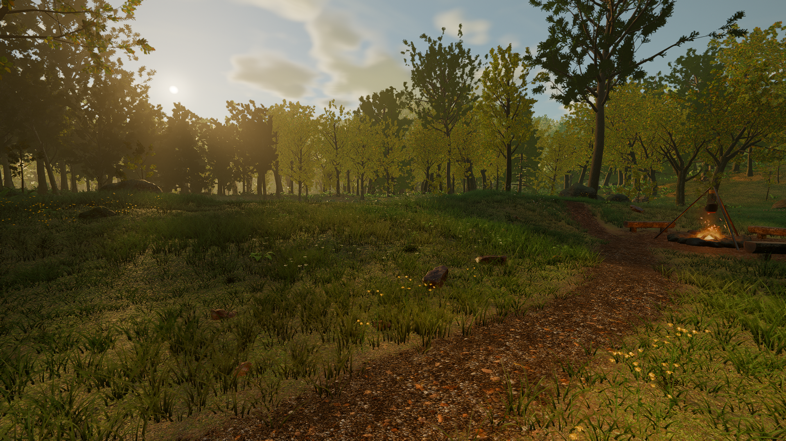
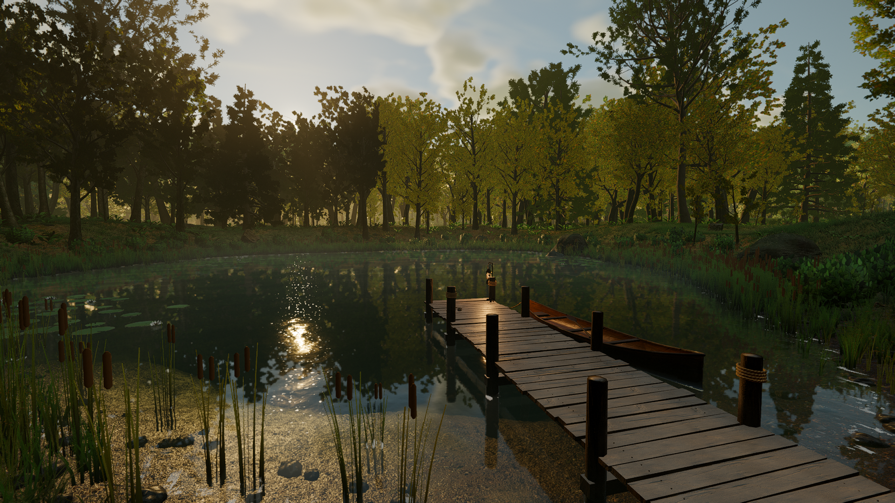
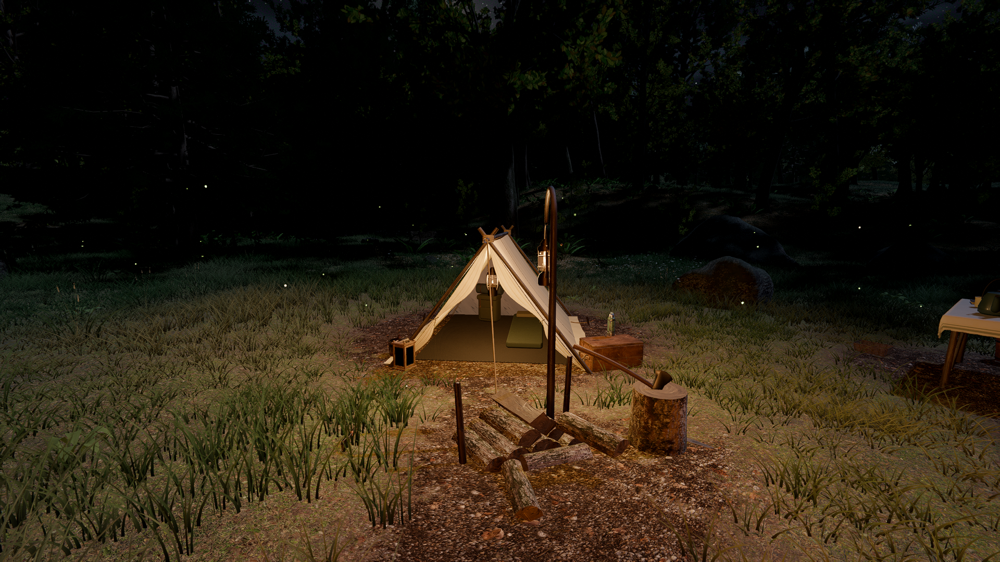

# The Last Camp

A forest campsite you can walk through, and an evening-to-dawn film made in
**Godot**. Explore the pond, tend the fire, skip stones, watch the weather
change, or use the free camera to inspect the scene.



The project combines procedural terrain, trees, grass and camp geometry with
credited photoscanned materials and dressing. All game logic, diagnostics and scene construction use C#, native Jolt
physics and Forward+ Vulkan. There are no addons or GDExtensions.

The published film is **5:37 at 1920×1080, 60 FPS**, including credits. A **1:51 showcase
reel** offers a shorter tour. Both use environmental sound and Foley with no
background music. Movie Maker renders them offline; their output FPS is not
the playable demo's frame rate.

## Start here

Install **Godot 4.8 dev6 .NET**, its matching .NET export templates, and the **.NET 8 SDK**. The engine is a development snapshot from
[godotengine.org](https://godotengine.org/article/dev-snapshot-godot-4-8-dev-6/). The project needs a Vulkan-capable
GPU and Forward+; the Compatibility renderer and web/mobile exports are not
supported. The current C# conversion is checked on Linux x86-64 with CPU-only tests.
Rendered appearance, gameplay and GPU performance have not yet been revalidated.
Other desktop platforms are not validated.

```bash
git clone https://github.com/dlprentice/the-last-camp.git
cd the-last-camp
dotnet build
godot --headless --path . --import
godot --path . --fullscreen
```

The first import builds Godot's local asset cache. Rebuild the C# assembly with
`dotnet build` after changing source. Everything is constructed in code; opening
the editor is optional, and the one-node main scene is only a bootstrap. The converted
textures, models and audio are included: no asset downloads, Python packages
or account sign-in are needed to play. Allow the loading screen to finish;
Space or a click skips the opening camera once loading is complete.

The default preset starts at High and can adapt downward. Use
`godot --path . --fullscreen -- --quality=medium` to select a fixed preset.
This is a demanding visual showcase. The earlier release's performance figures
do not establish the C# version's frame rate, and changing language alone does not
make its rendering faster. See [validation and limits](docs/validation.md).

## Controls

| Input | Action |
| --- | --- |
| W A S D | Walk |
| Shift / C | Run / crouch |
| E or left click | Interact with logs, fire, lanterns and skipping stones |
| L | Hand lantern |
| P | Photo mode; mouse wheel changes flight speed |
| F12 | Save a screenshot |
| T / [ / ] | Run or scrub the time of day |
| Tab / 1–4 | Quality panel / presets |
| F3 / H / F11 | Stats / hide HUD / fullscreen |
| Esc | Pause |

## Inside the scene

- A generated wooded landscape, layered meadow growth and shoreline habitat,
  with wind shared by grass, foliage and cloth.
- A changing atmosphere, volumetric clouds and fog, daylight, moonlight,
  indirect illumination and a scripted thunderstorm.
- Water reflection and transmission passes, distance-dependent underwater
  visibility, surface crossings, GPU wave disturbances and native canoe buoyancy.
- Wet materials, rain impacts and canopy drips; a campfire with smoke, sparks
  and heat distortion; native soft-body cloth.
- Birds, fish, butterflies, dragonflies, gnats and fireflies, with restrained
  environmental audio and surface-aware footsteps.
- A first-person controller, photo mode, deterministic cinematic paths,
  screenshot tools and repeatable local checks.



[Architecture](docs/architecture.md) explains how the effects fit together and
where they use approximations. [Development and rendering](docs/development.md)
contains the build, test, capture and asset-tool commands.

## Films and Linux build

Download the full film, shorter reel and Linux package from the
[release page](https://github.com/dlprentice/the-last-camp/releases/tag/v1.0.0).
Those are the earlier Godot 4.7.2 release's artifacts, not captures or a binary of
the current C# source. They are distributed with credits and SHA-256 checksums.
Render the current source, once its visual checks are authorized, with:

```bash
tools/render1080.sh one_night
```

This needs a graphical Linux session, Godot .NET, the .NET SDK, FFmpeg with libx264, Python,
NumPy, Pillow and ripgrep. It writes a fresh directory under
`local-data/renders/` and prints the exact output path. Expect substantially
longer than the film's running time. See [the rendering guide](docs/development.md#rendering).



## License and credits

Created by **David Prentice**. Original project code and documentation use the
[MIT license](LICENSE). Third-party shader code and assets retain their own
licenses; the recordings include **CC BY 3.0**, so this is not an all-CC0 asset pack.

[Complete credit index](CREDITS.md) · [Third-party notices](THIRD_PARTY_NOTICES.md)

If you share the film, include a link to the credits alongside it. The source
contains all nine material sets, 35 credited model assets and six recording
sources. The README screenshots are unaltered captures of the earlier release; they are
not new evidence for the C# conversion.
