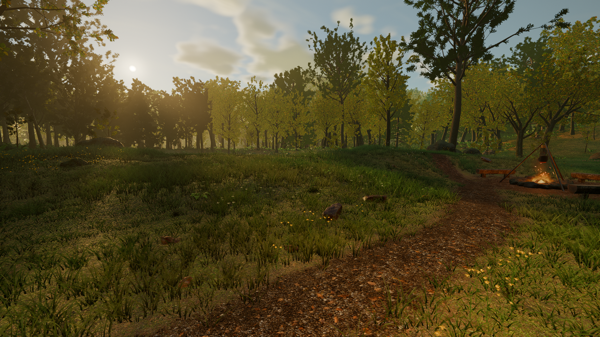
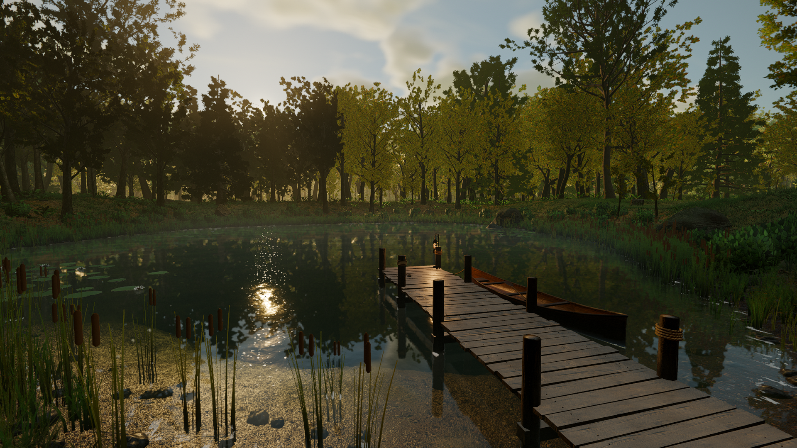
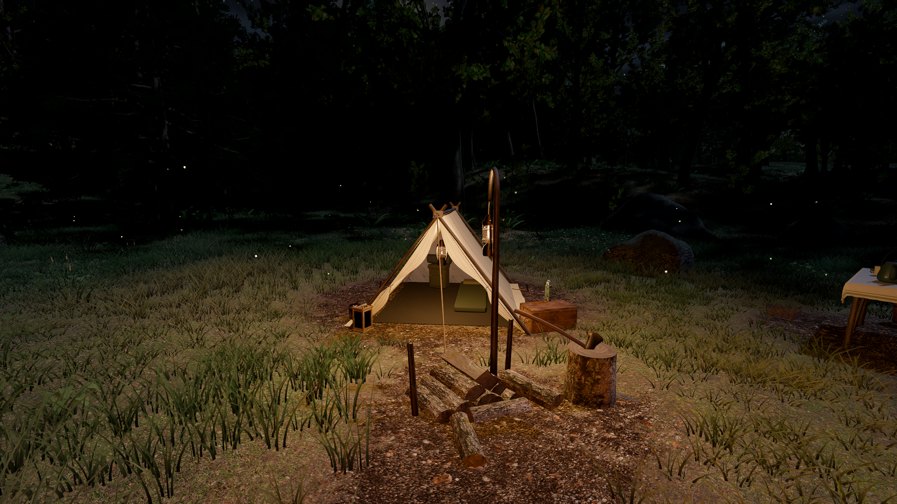

# The Last Camp

A small first-person camping game made in **Godot**. Spend an evening in the
woods: carry firewood, tend the fire, aim skipping stones across the pond,
light your lantern and turn in at the tent. Stay to explore when morning comes.



The project combines procedural terrain, trees, grass and camp geometry with
credited photoscanned materials and dressing. All game logic, diagnostics and scene construction use C#, native Jolt
physics and Forward+ Vulkan. There are no addons or GDExtensions.

## Start here

Install **Godot 4.8 dev6 .NET**, its matching .NET export templates, and the **.NET 8 SDK**. The engine is a development snapshot from
[godotengine.org](https://godotengine.org/article/dev-snapshot-godot-4-8-dev-6/). The project needs a Vulkan-capable
GPU and Forward+; the Compatibility renderer and web/mobile exports are not
supported. The C# source is tested on Linux x86-64, including offscreen GPU
captures and scripted traversal with the actual player controller. Performance
and visual polishing are ongoing; other desktop platforms are not validated.

```bash
git clone https://github.com/dlprentice/the-last-camp.git
cd the-last-camp
dotnet build
godot --headless --path . --import --quit-after 120 --max-fps 30
godot --path . --fullscreen
```

The first import builds Godot's local asset cache. Rebuild the C# assembly with
`dotnet build` after changing source. Everything is constructed in code; opening
the editor is optional, and the one-node main scene is only a bootstrap. The converted
textures, models and audio are included: no asset downloads, Python packages
or account sign-in are needed to play. After the loading screen, you start on
the trail with control of the player. The optional `-- --intro` camera arrival
can be skipped with Space or a click.

The default preset starts at High and can adapt downward. Use
`godot --path . --fullscreen -- --quality=medium` to select a fixed preset.
The distant woodland uses lit canopy atlases, with full geometry returning near
the player. Dense vegetation and shadows still make this a demanding scene.
See [validation and limits](docs/validation.md) for measured results and the
difference between interactive performance and offline movie output.

Press **J** for the camp journal. There is no survival timer: the evening's
activities introduce the interactions, and your best stone-skipping score is
saved locally. Light and weather advance during normal play. Once the evening's
activities are complete, the tent lets you rest until dusk and then sleep until dawn.

## Controls

| Input | Action |
| --- | --- |
| W A S D | Walk |
| Shift / C | Run / crouch |
| E or left click | Interact with logs, fire, lanterns and skipping stones |
| Hold/release left click with a stone | Charge and throw; aim low over the water |
| Right click while charging | Cancel the throw |
| L | Hand lantern |
| J | Camp journal; pauses the game while open |
| P | Photo mode; mouse wheel changes flight speed |
| F12 | Save a screenshot |
| T / [ / ] | Run or scrub the time of day |
| Tab / 1–4 | Quality panel / presets |
| F3 / H / F11 | Stats / hide HUD / fullscreen |
| Esc | Pause |

## Inside the scene

- A generated wooded landscape, layered meadow growth and shoreline habitat,
  with wind shared by grass, foliage and cloth.
- A changing atmosphere, volumetric clouds and fog, daylight, moonlight,
  indirect illumination and a scripted thunderstorm.
- Water reflection and transmission passes, distance-dependent underwater
  visibility, surface crossings, GPU wave disturbances and native canoe buoyancy.
- Wet materials, rain impacts and canopy drips; a campfire with smoke, sparks
  and heat distortion; native soft-body cloth.
- Birds, fish, butterflies, dragonflies, gnats and fireflies, with restrained
  environmental audio and surface-aware footsteps.
- A first-person controller, photo mode, deterministic cinematic paths,
  screenshot tools and repeatable local checks.



[Architecture](docs/architecture.md) explains how the effects fit together and
where they use approximations. [Development and rendering](docs/development.md)
contains the build, test, capture and asset-tool commands.

## Films and Linux build

The published film is **5:37 at 1920×1080, 60 FPS**, including credits. A **1:51 showcase
reel** offers a shorter tour. Both use environmental sound and Foley with no
background music. Movie Maker renders them offline; their output FPS is not
the game's interactive frame rate.

Download the full film, shorter reel and Linux package from the
[release page](https://github.com/dlprentice/the-last-camp/releases/tag/v1.0.0).
Those are the earlier Godot 4.7.2 release's artifacts, not captures or a binary of
the current C# source. They are distributed with credits and SHA-256 checksums.
The existing offline rendering tool remains available with:

```bash
tools/render1080.sh one_night
```

This needs a graphical Linux session, Godot .NET, the .NET SDK, FFmpeg with libx264, Python,
NumPy, Pillow and ripgrep. It writes a fresh directory under
`local-data/renders/` and prints the exact output path. Expect substantially
longer than the film's running time. See [the rendering guide](docs/development.md#rendering).



## License and credits

Created by **David Prentice**. Original project code and documentation use the
[MIT license](LICENSE). Third-party shader code and assets retain their own
licenses; the recordings include **CC BY 3.0**, so this is not an all-CC0 asset pack.

[Complete credit index](CREDITS.md) · [Third-party notices](THIRD_PARTY_NOTICES.md)

If you share the film, include a link to the credits alongside it. The source
contains all nine material sets, 35 credited model assets and six recording
sources. The README screenshots are unaltered captures of the earlier release; they are
not new evidence for the C# conversion.
